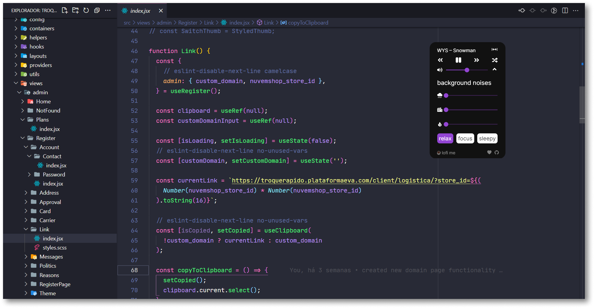

  

☕ a simple lofi player for desktop.

<space><space>

# Preview

  

# Installation

Download the latest version from [releases page](https://github.com/divinurised/lofi-me/releases) and run it (no installation needed).

# Overview

Listen to lofi while coding, studying, working, gaming and etc. Stay focused and improve your productivity.

No more worries about browser RAM usage, no more multiple tabs to listen lofi, hide the window, pause and control the volume whenever you want.

Choose between 3 popular lofi [playlists](https://lofi-me.vercel.app) from youtube. Create your comfortable environment with some background noises.

# Usage

<table>
  <thead>
    <tr>
      <th>Function</th>
      <th>Usage</th>
    </tr>
  </thead>
  <tbody>
    <tr>
      <td>Grab window around the screen</td>
      <td>Click and hold the song title</td>
    </tr>
    <tr>
      <td>Reset window position</td>
      <td>Click on the taskbar icon and then click on 'reset position'</td>
    </tr>
    <tr>
      <td>Hide window</td>
      <td>Click on the double arrow icon next to the song title</td>
    </tr>
  </tbody>
</table>

# Contributing

> Contributions are always welcome, but always **ask first**, — please — before work on a PR.

Ways that you can contribute:

## Main

- 💻 Cleaning and improving the code.
- 💅 Adding themes.
- 🪲 Reporting a bug.

## Others

- 🌧️ Sending background noises ideas
- 🎵 Sending playlists ideas

Take a look at the [contribution guidelines](https://github.com/divinurised/lofi-me/CONTRIBUTING.md) and open a [new issue](https://github.com/divinurised/lofi-me/issues) or [pull request](https://github.com/divinurised/lofi-me/pulls) on GitHub.

### Code of Conduct

Before contributing to this repository, please read the [code of conduct.](https://github.com/divinurised/lofi-me/CODE_OF_CONDUCT.md)

## Have an idea?

We’re using [GitHub Discussions](https://github.com/divinurised/lofi-me/discussions) to create conversations around **lofi me**. It is a place for our community to connect with each other around ideas, questions, issues, and suggestions.

# Supporting

if somehow we help you, consider following the steps:

- ⭐ Give a star on this repository.
- 📣 Share this project.
- ☕ **Donate at [Ko-fi](https://ko-fi.com/divinurised).**

# Author

👤 Davi Alcântara

- Twitter: [@divinurised](https://twitter.com/divinurised)
- Github: [@divinurised](https://github.com/divinurised)
- LinkedIn: [@divinurised](https://linkedin.com/in/divinurised)

# License

MIT © [Davi Alcântara](https://github.com/divinurised/lofi-me/LICENSE.md)

#

Made with ⭐ by Davi Alcântara
